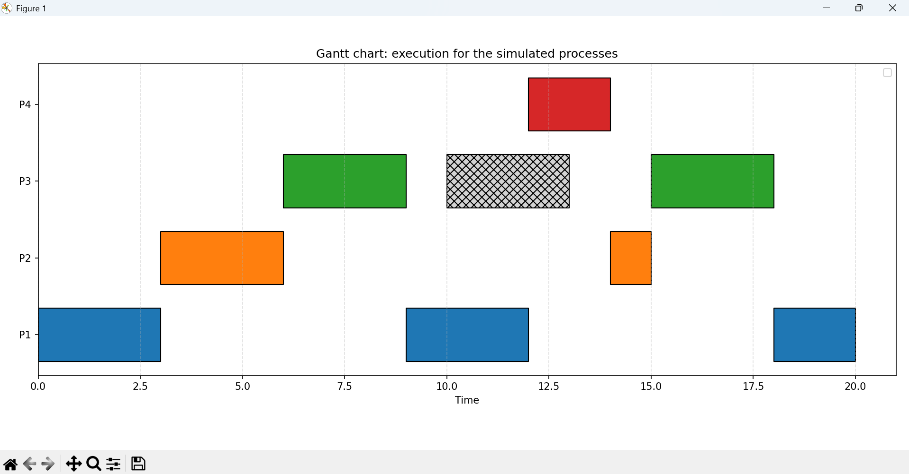

# CPU Scheduling Simulation (Operating System Project)

This project simulates the Round-Robin CPU scheduling algorithm with random I/O interrupts and visualizes the process execution using a Gantt chart.

## Features
- **Round-Robin Scheduling:** Simulates process scheduling with a configurable time quantum (default: 3).
- **Random I/O Interrupts:** Processes may be interrupted for I/O, with random durations.
- **Detailed State Logging:** Prints process state transitions (New, Ready, Running, Waiting, Terminated) with reasons.
- **Performance Metrics:** Calculates and displays per-process and average turnaround and waiting times.
- **Gantt Chart Visualization:** Generates a detailed Gantt chart of process execution and I/O using matplotlib.

## Requirements
- Python 3.x
- [matplotlib](https://matplotlib.org/) (for Gantt chart visualization)

Install matplotlib if not already installed:
```bash
pip install matplotlib
```

## Usage
1. Edit the process list at the bottom of `OS1_updated.py` to define your processes (PID, arrival time, burst time).
2. Run the script:
```bash
python OS1_updated.py
```
3. The simulation will print a detailed log and metrics. If matplotlib is installed, a Gantt chart will be displayed and saved as `gantt_detailed.png`.

## Example
Default processes in the script:
- P1: Arrival=0, Burst=8
- P2: Arrival=1, Burst=4
- P3: Arrival=3, Burst=6
- P4: Arrival=5, Burst=2

## Output
- Console log of process state transitions and metrics
- Gantt chart image (`gantt_detailed.png`)

### Gantt Chart Example


## Customization
- Change the `time_quantum` parameter in `run_simulation()` to adjust the Round-Robin quantum.
- Modify the process list to simulate different scenarios.


---
For questions or improvements, feel free to contribute or contact the author.