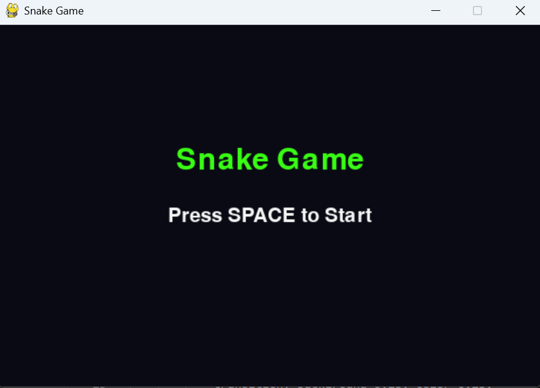
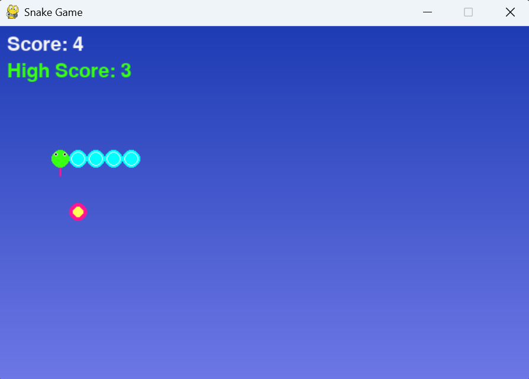
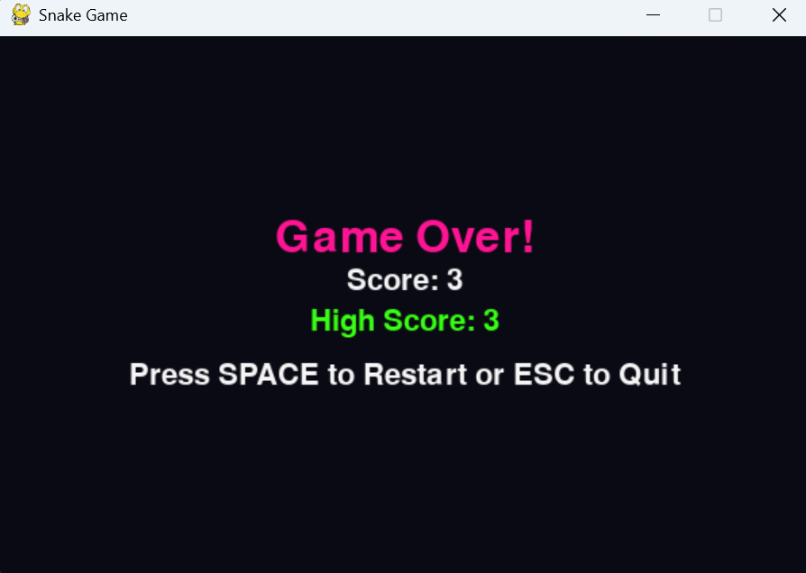

# Neon Snake Game

A modern neon-themed Snake game built with Python and Pygame.

## Features
- Neon colors and gradient background
- Animated snake with eyes and tongue
- High score tracking (saved in `highscore.txt`)
- Start menu and game over screen
- Keyboard controls (arrow keys)

## Screenshots

Below are the main screens of the game. Make sure the image files (`start.png`, `play.png`, `over.png`) are present in the main folder for the images to display correctly on GitHub or other markdown viewers.

### Start Screen


### Gameplay


### Game Over


## How to Run
1. Make sure you have Python 3 and Pygame installed:
   ```bash
   pip install pygame
   ```
2. Run the game:
   ```bash
   python snake_game.py
   ```

## Folder Structure
```
assets/           # (currently empty, for future assets)
highscore.txt     # stores the high score
snake_game.py     # main game code
start.png         # start screen image
play.png          # gameplay screenshot
over.png          # game over screenshot
```

## Controls
- Arrow keys: Move the snake
- SPACE: Start/Restart game
- ESC: Quit from game over screen

---
Enjoy the game!