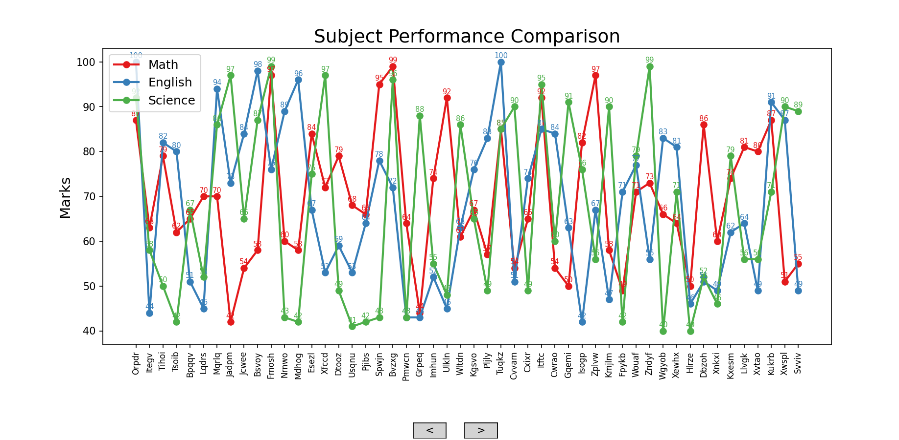
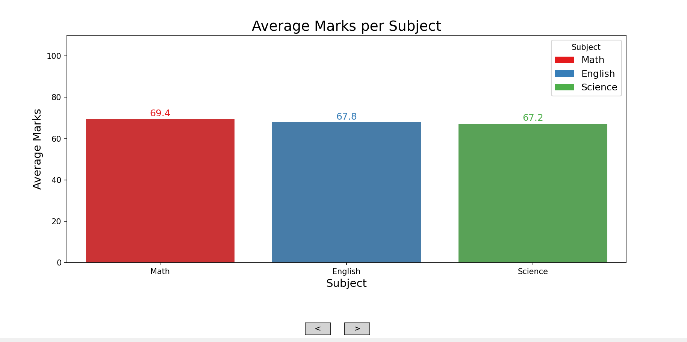

# Student Performance Dashboard

This project is a Python-based dashboard for analyzing and visualizing student performance data. It uses a CSV file of student marks and provides interactive and static visualizations to help understand the data.

## Features
- **Reads student data from `students.csv`** (Name, Math, English, Science)
- **Calculates averages** for each student and each subject
- **Identifies best and worst students**
- **Interactive dashboard** with navigation buttons to switch between different charts
- **Visualizations include:**
  1. Average marks per student (bar chart)
  2. Subject performance comparison (line chart)
  3. Average marks per subject (bar chart with legend)
  4. Distribution of all marks (histogram)
- **Saves static images** of the charts in the project folder

## Requirements
- Python 3.x
- pandas
- matplotlib
- seaborn

Install requirements with:
```bash
pip install pandas matplotlib seaborn
```

## How to Run
1. Make sure `students.csv` is present in the folder (or let the script generate it).
2. Run the dashboard:
   ```bash
   python student_dashboard.py
   ```
3. The dashboard will display interactive charts. Navigation buttons `<` and `>` are centered below the chart.
4. Static images of the charts will be saved in the folder as:
   - `bar chart.png`
   - `chart.png`
   - `all marks.png`
   - `marks.png`

## Example Visualizations

### Average Marks per Student


### Subject Performance Comparison


### Average Marks per Subject


### Distribution of All Marks


---

Feel free to modify the code or CSV for your own analysis!
