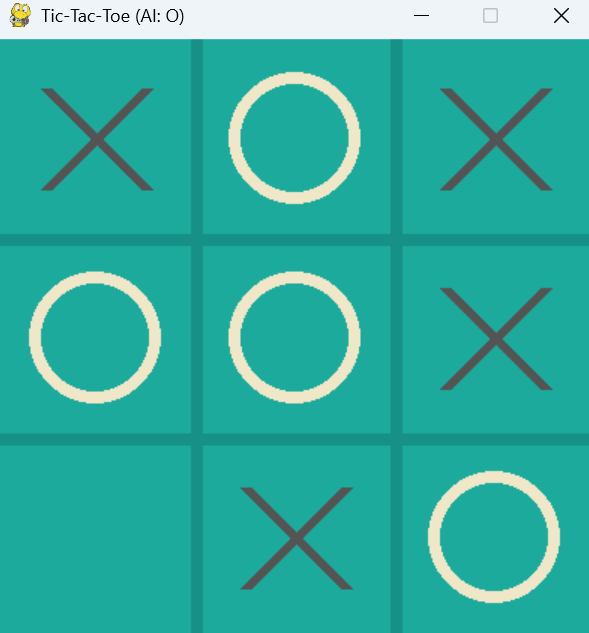
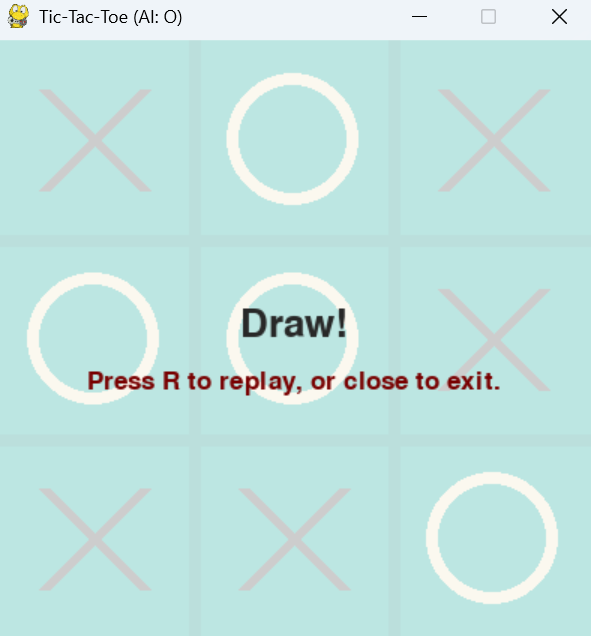
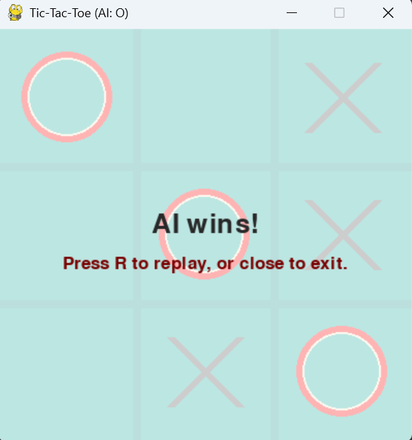

# Tic-Tac-Toe Game

This project contains both console-based and graphical (Pygame) implementations of the classic Tic-Tac-Toe game, with an AI opponent using the Minimax algorithm.

## Features
- Play against an AI in the console or with a graphical interface
- AI uses the Minimax algorithm for optimal moves
- Pygame version features a modern UI and mouse interaction

## Files
- `main.go`, `ai.go`, `board.go`, `rules.go`: Go implementation (console)
- `tic_tac_toe.py`: Python console implementation
- `tic_tac_toe_pygame.py`: Python Pygame graphical implementation
- `draw.png`, `play.png`, `Wins.png`: Game-related images

## Screenshots

### Game Play


### Draw State


### Win State


## How to Run

### Python (Pygame GUI)
1. Make sure you have Python and Pygame installed:
   ```bash
   pip install pygame
   ```
2. Run the graphical game:
   ```bash
   python tic_tac_toe_pygame.py
   ```

### Python (Console)
1. Run the console game:
   ```bash
   python tic_tac_toe.py
   ```

### Go (Console)
1. Make sure you have Go installed.
2. Run the Go game:
   ```bash
   go run main.go
   ```

---

Enjoy playing Tic-Tac-Toe!
